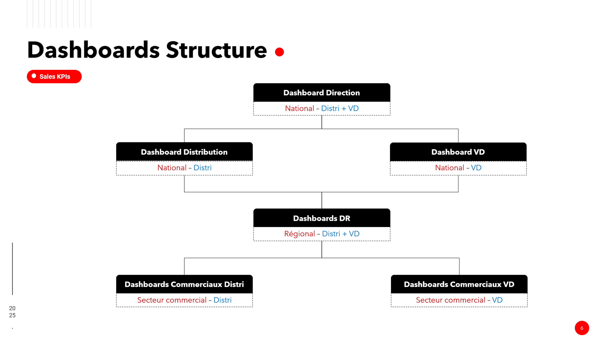
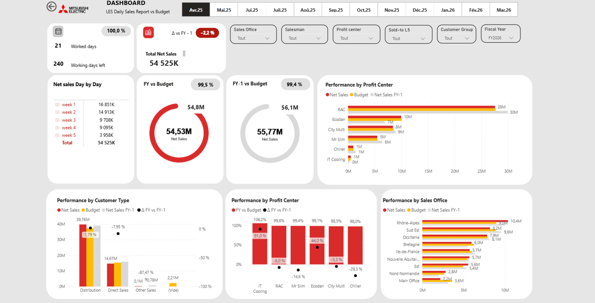
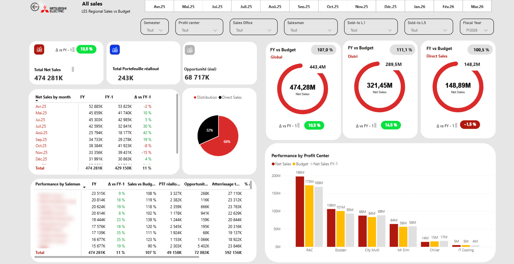
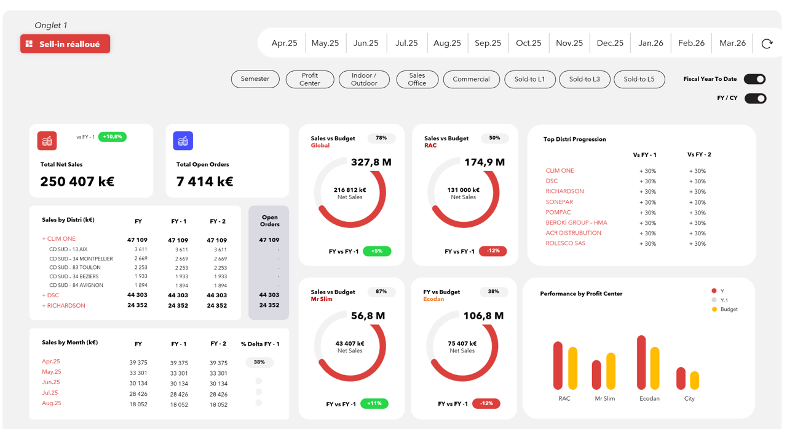

# Sales Performance Monitoring System

## Context

This project simulates the redesign of a sales performance monitoring system in a large B2B environment.

The initial context was:
- fragmented data sources
- inconsistent KPI definitions
- lack of alignment between teams
- limited usability of existing reporting tools

---

## Objective

Build a structured, reliable and scalable system to monitor sales performance across multiple levels of the organization.

---

## System structure

The reporting system was designed to reflect the organizational structure:

- National dashboards for executive view
- Regional dashboards for performance tracking
- Sales-level dashboards for operational follow-up

With different perspectives:
- Distribution
- Direct sales
- Sell-in vs Sell-out

## What was designed

### Data layer
- centralized data into a unified platform
- cleaned and structured datasets
- aligned KPI definitions across teams

### KPI framework
- clarified business rules
- reconciled conflicting metrics (sell-in vs sell-out)
- defined consistent performance indicators

### Dashboard architecture

Designed a multi-level dashboard system:

- National level (global performance)
- Distribution vs Direct Sales views
- Regional dashboards
- Salesman-level dashboards

Each level provides:
- consistent KPIs
- adapted granularity
- clear performance tracking vs budget and previous year

  

---

## Dashboard examples

Below are examples of dashboards designed as part of a structured sales performance monitoring system.

### Main dashboard (global view)

---

### Regional view

---

### KPI / reallocation logic example

---

## Key challenges addressed

- Differences between sell-in and sell-out logic
- KPI inconsistencies across teams
- Lack of trust in data
- Overly complex or unusable dashboards

---

## Outcome

- clearer and aligned KPIs
- improved data reliability
- better usability for business teams
- structured decision-making framework

---

## Key takeaway

A dashboard is not just a visual tool.  
It is part of a broader system combining data, business rules and decision logic.
This work goes beyond dashboard design and focuses on building a coherent performance monitoring system aligned with business structure.
